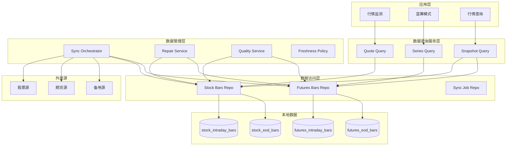
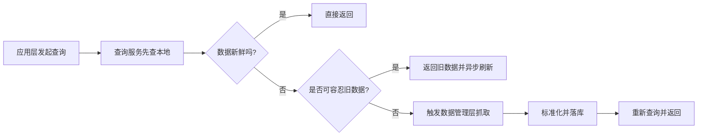

# 架构设计

## 1. 总体分层

系统按四层组织：

1. 数据管理层
2. 数据查询服务层
3. 应用层
4. 数据访问层

## 1.1 相关设计文档

- [10_行情数据模块设计.md](/Users/ddxx/Dev/TestWs/peng_stock_analysis/docs/10_行情数据模块设计.md)：应用层中的数据治理控制台模块
- [11_行情监测模块设计.md](/Users/ddxx/Dev/TestWs/peng_stock_analysis/docs/11_行情监测模块设计.md)：应用层中的统一行情消费看板模块
- [12_数据管理层设计.md](/Users/ddxx/Dev/TestWs/peng_stock_analysis/docs/12_数据管理层设计.md)：数据采集、同步、补数、质量治理设计
- [13_数据查询服务层设计.md](/Users/ddxx/Dev/TestWs/peng_stock_analysis/docs/13_数据查询服务层设计.md)：统一查询、聚合、新鲜度与降级设计
- [14_数据访问层设计.md](/Users/ddxx/Dev/TestWs/peng_stock_analysis/docs/14_数据访问层设计.md)：Repository、SQL、事务和索引约束的轻量规范

## 2. 四层功能边界

### 2.1 数据管理层

负责：

- 外部行情采集
- 本地落库
- 定时同步
- 手动补数
- 缺口检查
- 数据质量治理
- 新鲜度管理
- 物化聚合决策

### 2.2 数据查询服务层

负责：

- 统一行情查询入口
- 股票/期货路由
- `intraday/eod` 路由
- 实时聚合
- 统一 DTO 输出
- 来源说明与告警输出

### 2.3 应用层

负责：

- 行情监测
- 行情查询
- 蓝筹模式
- 分析、预警、导出、报表等业务能力

说明：

- 前端页面入口都属于应用层表现形态
- 但页面背后的业务职责，可以分别归属于数据管理层或数据查询服务层
- 例如：`行情数据` 是应用层页面入口，但承载的是数据管理层能力

### 2.4 数据访问层

负责：

- Repository
- SQL
- 批量写入
- 索引命中
- 分页与范围查询

## 3. 市场数据专题架构

### 3.1 设计原则

- 股票与期货物理存储继续分开
- 每类行情采用 `intraday + eod` 双事实表
- `5m/15m/30m/60m` 优先由日内基础数据实时聚合
- `1w/1M/1Y` 优先由日线基础数据实时聚合
- 若后续性能需要，可在对应基础表中物化更高粒度数据
- 应用层禁止直接访问第三方数据源

### 3.2 分层架构图

## 4. 主要模块说明

### 数据管理层模块

- `MarketDataSyncOrchestrator`：同步编排、源切换、并发与重试控制
- `MarketDataRepairService`：手动补数和缺口修复
- `MarketDataQualityService`：覆盖率、缺口、异常值检查
- `MarketFreshnessPolicyService`：新鲜度判断和刷新策略
- `BarNormalizer`：第三方数据标准化转换
- `MarketBarWriter`：统一批量写入和 upsert

### 数据查询服务层模块

- `MarketQuoteQueryService`：最新价查询
- `MarketSeriesQueryService`：K 线查询与聚合
- `MarketMonitorQueryService`：监测模块统一查询入口
- `MarketSnapshotQueryService`：摘要信息查询

### 应用层模块

- `行情数据`：数据管理层前台入口
- `行情监测`：业务消费型监测看板
- `蓝筹模式`：股票分析业务模块
- `行情查询`：统一查询与检索页面

### 数据访问层模块

- `StockBarsRepository`
- `FuturesBarsRepository`
- `MarketSyncJobRepository`
- `MonitorRepository`

## 5. 同步与查询协作关系

## 6. 数据存储

核心行情表：

- `stock_intraday_bars`
- `stock_eod_bars`
- `futures_intraday_bars`
- `futures_eod_bars`

建议增加的治理表：

- `market_sync_jobs`
- `market_sync_job_items`
- `market_data_quality_reports`

其他业务表继续独立维护，如：

- `analysis_history`
- `backtest_results`
- `portfolio_*`
- `chat_*`

## 7. 关键设计决策

- 行情数据采用“强同步 EOD + 弱同步 Intraday + 查询触发刷新”的混合策略
- 股票和期货继续分表、分同步、分治理，减少互相干扰
- 查询服务统一对上输出，不要求底层物理合表
- 应用层不能直接实现源切换和补数逻辑
- 数据管理层和数据查询服务层必须严格分离
