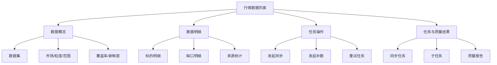
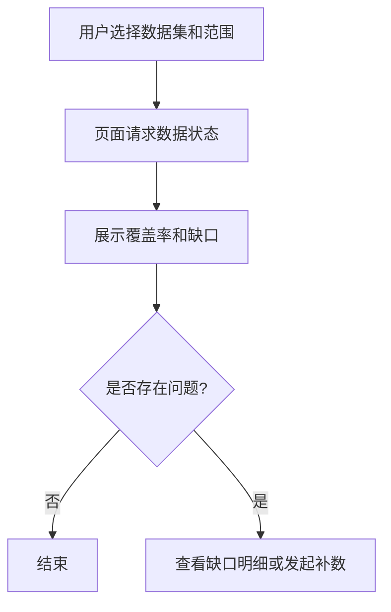
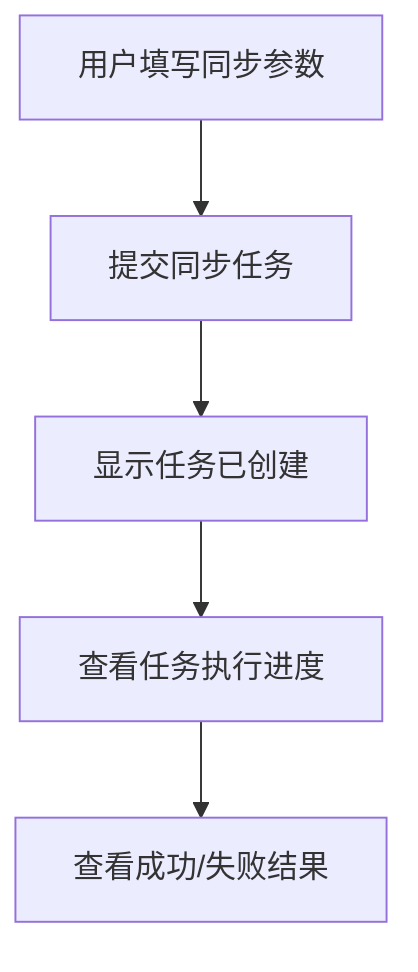
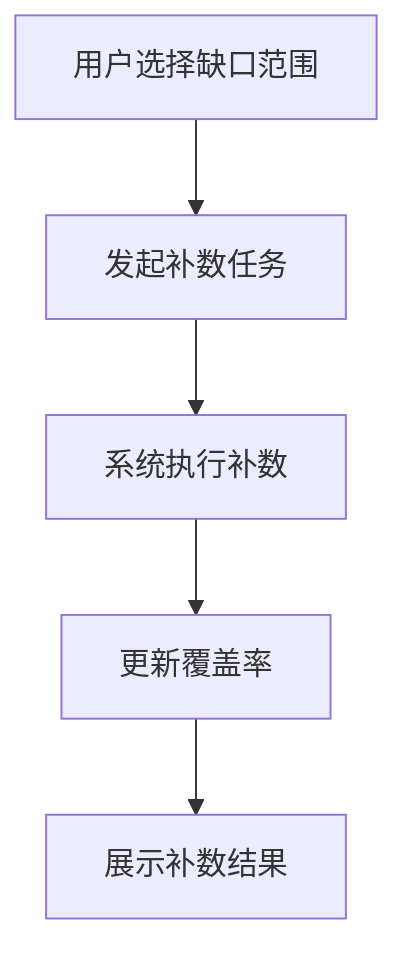

# 10 行情数据模块设计

## 1. 模块定位

`/market-data` 是一个**应用层页面入口**，承载的是 **数据管理层** 能力。

它的职责不是展示业务行情看板，而是为运维、分析和数据治理提供一个可操作的控制台，用来管理本地行情数据的完整性、同步状态和补数结果。

一句话定义：

**行情数据 = 市场数据治理控制台**

## 2. 模块目标

本模块聚焦 5 个目标：

1. 查看本地行情数据覆盖情况
2. 发起同步和补数任务
3. 查看同步任务执行状态
4. 查看数据质量检查结果
5. 为其它业务模块提供“数据是否可用”的可视化依据

## 3. 目标用户

主要面向：

- 管理员
- 运维/数据治理人员
- 需要排查数据缺口的分析用户

不面向：

- 普通业务看盘用户
- 只关心实时价格的监控用户

## 4. 模块边界

### 4.1 本模块负责

- 选择数据集并查看覆盖情况
- 按市场/标的/时间范围/粒度查看本地数据状态
- 发起同步任务
- 发起补数任务
- 查看任务进度、失败原因、重试结果
- 查看质量巡检结论
- 在查询层展示今日日K时，区分正式日线与实时合成日线

### 4.2 本模块不负责

- 展示股票/期货实时监控卡片
- 展示策略分析结果
- 解释买卖点信号
- 直接实现第三方源抓取逻辑
- 直接实现 SQL 查询细节

跨层能力由下层承担：

- 数据管理层：同步、补数、质量治理
- 数据查询服务层：统一查询和新鲜度判断
- 数据访问层：Repository 和 SQL

## 5. 页面功能结构

建议按 4 个工作区组织页面。

### 5.1 数据概览区

用于查看数据总体健康度：

- 数据集切换
- 市场切换
- 粒度切换
- 时间范围选择
- 覆盖率
- 缺口数
- 最近同步时间
- 数据新鲜度摘要

### 5.2 数据明细区

用于查看当前筛选条件下的数据明细：

- 标的数量
- 总 bar 数量
- 缺失区间
- 异常区间
- 来源统计
- 可疑数据提示

### 5.3 任务操作区

用于发起管理动作：

- 发起同步
- 发起补数
- 发起重试
- 指定标的同步
- 指定范围补数

### 5.4 任务与质量结果区

用于查看执行结果：

- 同步任务列表
- 子任务列表
- 失败原因
- 质量巡检报告
- 处理建议

## 6. 页面信息架构图

## 7. 典型使用场景

### 7.1 查看数据是否足够支持业务

例如：

- 蓝筹模式分析前，确认 `stock_eod_bars` 是否完整
- 行情监测异常时，确认 `futures_intraday_bars` 是否缺分钟

### 7.1.1 今日日K展示规则

`stock_eod_bars` 中可能同时存在正式日线和实时合成日线：

- 正式日线：来自 `tushare.daily`、`eastmoney.kline` 等正式日线源
- 实时合成日线：来源于 `realtime.synthetic.1d:*`

规则：

- 仅在 A 股交易时段允许补“今日日K”
- 非交易时段不生成今日日K
- 若当前非交易时段且当天已存在 synthetic 记录，查询会清理该记录，避免昨天的实时快照冒充今天的 K 线
- 若实时源时间戳不属于当天，则不作为今日日K合成依据

### 7.1.2 单品种分时K线展示规则

- K线详情页股票默认展示 `1m` 分时
- 分时数据应走分钟链路（mootdx/tencent/xtick/yahoo），不使用日线聚合近似
- 分时查询为单品种直查，不依赖行情监测分类池

### 7.2 手动补数

例如：

- 某只股票某段日线缺失
- 某个期货品种夜盘分钟数据缺口较大

### 7.3 排查同步失败

例如：

- 主源超时
- 备源返回空数据
- 某时间范围重复写入失败

## 8. 页面交互流程

### 8.1 数据检查流程

### 8.2 手动同步流程

### 8.3 补数流程

## 9. 输入与输出

### 9.1 输入条件

建议支持：

- 数据集
- 市场
- 标的代码/名称
- 时间粒度
- 开始时间
- 结束时间
- 任务类型（同步/补数/重试）

### 9.2 输出内容

页面输出聚焦治理信息：

- 覆盖率
- 缺口统计
- 最新同步时间
- 数据来源统计
- 任务执行状态
- 失败原因
- 质量结论
- 若当前筛选范围包含今天，页面应明确标识该条是否为 `realtime.synthetic.1d:*`

## 10. 依赖关系

本模块依赖：

- 数据管理层文档：[12_数据管理层设计.md](/Users/ddxx/Dev/TestWs/peng_stock_analysis/docs/12_数据管理层设计.md)
- 数据查询服务层文档：[13_数据查询服务层设计.md](/Users/ddxx/Dev/TestWs/peng_stock_analysis/docs/13_数据查询服务层设计.md)
- 总架构文档：[03_架构设计.md](/Users/ddxx/Dev/TestWs/peng_stock_analysis/docs/03_架构设计.md)

本模块不重复定义：

- 同步编排细节
- 源适配器设计
- 查询统一 DTO
- Repository 结构

这些内容都下沉到对应层级文档。

## 11. 对外能力

本模块对系统的价值主要体现在：

- 给业务模块提供可观测的数据健康状态
- 给管理员提供同步与补数入口
- 给排障过程提供任务和失败上下文

## 12. 模块结论

`行情数据` 文档应只聚焦这个模块自身：

- 它是什么页面
- 它服务谁
- 它给用户什么能力
- 它依赖哪些下层服务
- 它不能越界做什么

更底层的同步、抓取、聚合、质量治理设计，统一归入数据管理层和数据查询服务层文档。
