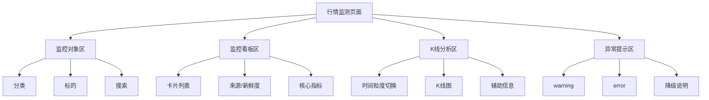
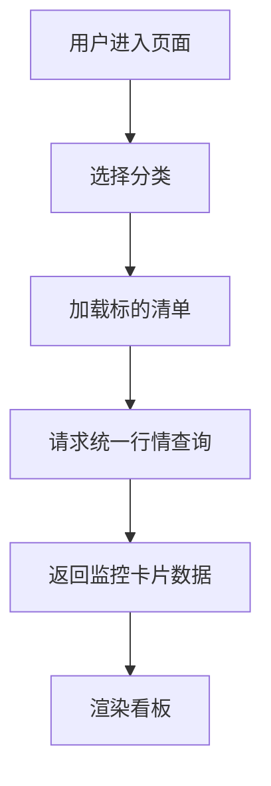
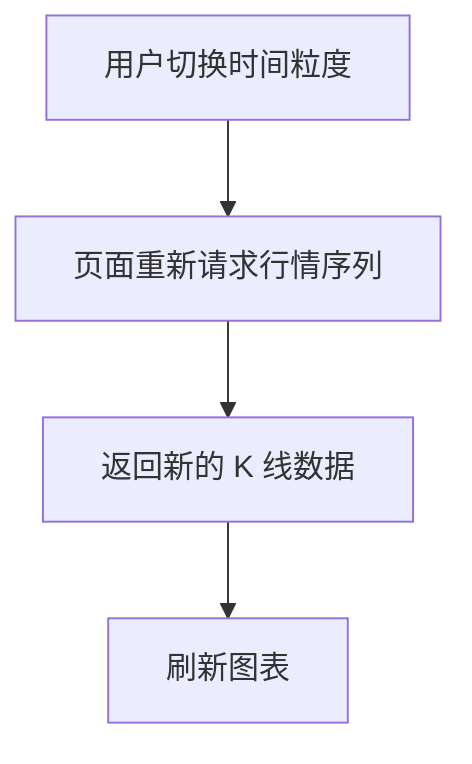
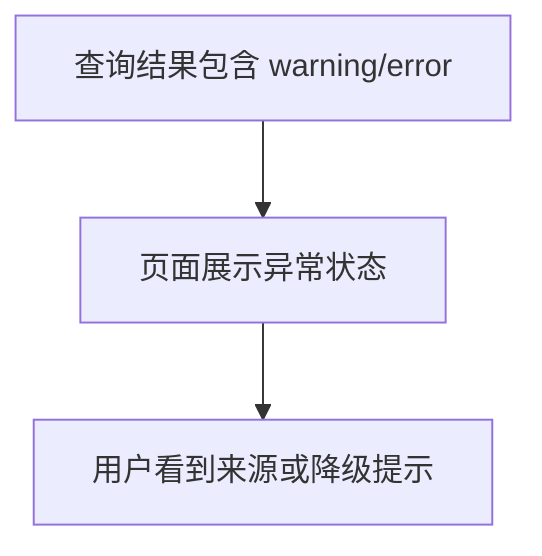

# 11 行情监测模块设计

## 1. 模块定位

`/stock-monitor` 是一个**应用层业务模块**。

它面向用户提供统一的股票/期货行情监测视图，用于看盘、跟踪、自选观察和快速判断当前标的状态。

一句话定义：

**行情监测 = 统一行情消费看板**

## 2. 模块目标

本模块聚焦 5 个目标：

1. 展示用户关心的监控标的
2. 提供最新价和 K 线视图
3. 提供分类管理和监控组织能力
4. 提供来源、告警、异常的可解释展示
5. 在数据不足时优雅降级，而不是让整页不可用

## 3. 模块边界

### 3.1 本模块负责

- 管理监控分类和标的组织方式
- 触发统一行情查询
- 展示监控卡片
- 展示多粒度 K 线
- 展示来源、新鲜度、告警、错误状态

### 3.2 本模块不负责

- 第三方行情源切换
- 同步任务编排
- 手动补数
- 数据质量巡检
- 直接访问本地基础行情表

这些能力由下层承担：

- 数据查询服务层：统一查询、聚合、来源说明
- 数据管理层：同步、补数、质量治理
- 数据访问层：Repository 与 SQL

## 4. 页面功能结构

建议按 4 个工作区组织页面。

### 4.1 监控对象区

用于管理监控对象：

- 分类切换
- 分类管理
- 标的增删改
- 标的排序
- 标的搜索

### 4.2 监控看板区

用于快速查看当前状态：

- 最新价
- 涨跌额/涨跌幅
- 前收/成交量等摘要
- 数据来源
- 新鲜度状态
- 告警和错误

### 4.3 K 线分析区

用于查看图形走势：

- 分钟/K 线切换
- 多粒度切换
- 区间缩放
- 基础统计信息

### 4.4 异常提示区

用于解释数据问题：

- 数据 stale 提示
- 降级源提示
- 抓取失败提示
- 局部标的异常提示

## 5. 页面信息架构图

## 6. 典型使用场景

### 6.1 日常盯盘

用户按分类查看重点股票、重点期货的当前状态和走势。

### 6.2 快速定位异常标的

用户通过涨跌、告警、错误状态快速锁定需要进一步查看的标的。

### 6.3 查看来源与可用性

当某标的展示异常时，用户可以看到：

- 当前数据来源
- 是否是旧缓存
- 是否发生了降级
- 是否某一路数据失败

## 7. 页面交互流程

### 7.1 监控查看流程

### 7.2 切换粒度流程

### 7.3 异常展示流程

## 8. 输入与输出

### 8.1 输入条件

本模块主要输入：

- 分类
- 标的列表
- 搜索条件
- 时间粒度
- 图表数量或历史窗口

### 8.2 输出内容

本模块主要输出：

- 标的卡片
- 最新价摘要
- K 线序列
- 来源说明
- 新鲜度说明
- warning / error

## 9. 依赖关系

本模块依赖：

- 数据查询服务层文档：[13_数据查询服务层设计.md](/Users/ddxx/Dev/TestWs/peng_stock_analysis/docs/13_数据查询服务层设计.md)
- 数据管理层文档：[12_数据管理层设计.md](/Users/ddxx/Dev/TestWs/peng_stock_analysis/docs/12_数据管理层设计.md)
- 总架构文档：[03_架构设计.md](/Users/ddxx/Dev/TestWs/peng_stock_analysis/docs/03_架构设计.md)

本模块不重复定义：

- 查询服务内部路由规则
- 新鲜度策略
- 查询触发刷新策略
- 底层行情表模型
- 同步任务机制

## 10. 与其它模块的关系

### 与行情数据模块

- `行情监测`：面向业务消费
- `行情数据`：面向数据治理

### 与蓝筹模式

- `行情监测`：偏观察和跟踪
- `蓝筹模式`：偏分析和信号判断

### 与行情查询

- `行情监测`：围绕预设监控对象组织
- `行情查询`：围绕临时查询需求组织

## 11. 模块结论

`行情监测` 文档应只聚焦这个模块自身：

- 页面展示什么
- 用户怎么用
- 模块输出什么
- 依赖哪些查询能力
- 出异常时如何表现

而不再承担同步、补数、底层抓取和跨层数据治理设计。
