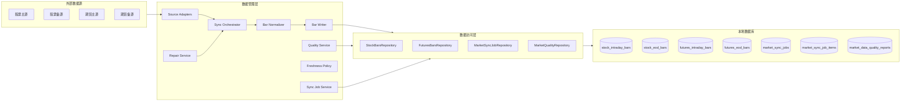
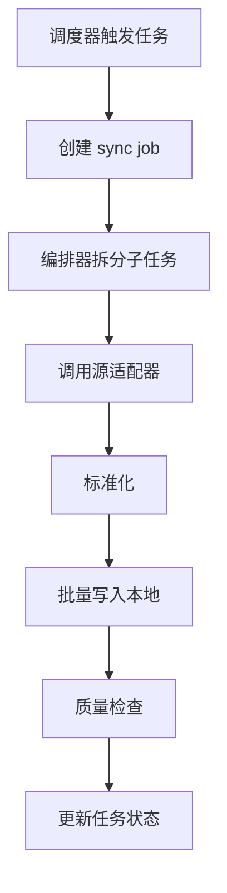
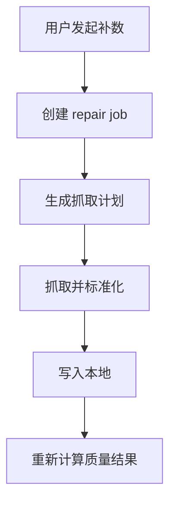
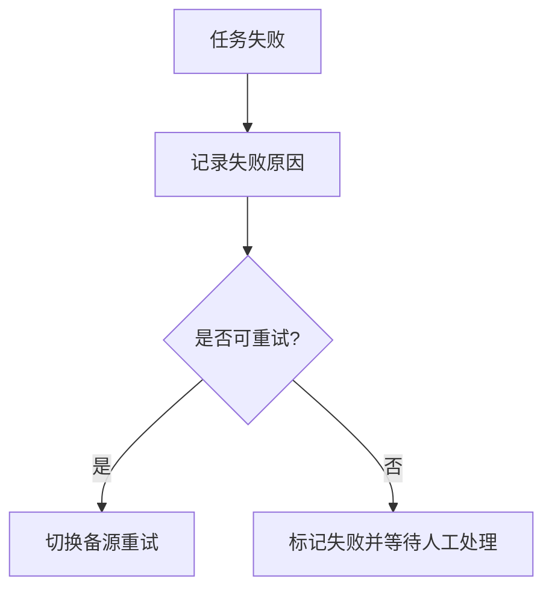

# 12 数据管理层设计

## 1. 层次定位

数据管理层负责：

**把外部行情数据稳定采集到本地，并保证本地数据可补、可查、可治理。**

它是四层架构中的“数据生产和治理层”。

## 2. 核心职责

数据管理层负责：

- 外部行情采集
- 数据源切换与降级
- 本地落库
- 定时同步
- 手动补数
- 缺口检查
- 质量巡检
- 新鲜度策略维护
- 派生粒度物化决策

数据管理层不负责：

- 业务页面渲染
- 应用层交互
- 统一查询 DTO 输出
- 页面筛选和展示逻辑

## 3. 层内模块拆分

建议拆分为 9 类核心服务：

1. `StockMarketSourceAdapter`
2. `FuturesMarketSourceAdapter`
3. `MarketDataSyncOrchestrator`
4. `BarNormalizer`
5. `MarketBarWriter`
6. `MarketDataQualityService`
7. `MarketDataRepairService`
8. `MarketFreshnessPolicyService`
9. `MarketSyncJobService`

## 4. 层内架构图

## 5. 基础数据模型

### 5.1 基础事实表

股票：

- `stock_intraday_bars`
- `stock_eod_bars`

期货：

- `futures_intraday_bars`
- `futures_eod_bars`

### 5.2 粒度策略

- `1m` 作为日内基础粒度
- `1d` 作为 EOD 基础粒度
- `5m/15m/30m/60m` 默认实时聚合
- `1w/1M/1Y` 默认实时聚合
- 性能不足时再物化到基础表中

## 6. 同步总体策略

同步采用混合模式：

- `EOD` 强同步
- `Intraday` 弱同步
- 支持手动补数
- 支持查询触发刷新

### 6.1 EOD 强同步

目标：

- 形成稳定基准数据
- 支撑分析、回测、长周期查询

建议：

- 收盘后批量同步
- 同步失败后进入补数队列
- 质量巡检按交易日执行

### 6.2 Intraday 弱同步

目标：

- 优先保障核心监控标的
- 降低全市场分钟抓取成本

建议：

- 核心标的预抓 `1m`
- 普通标的按需抓取
- 衍生分钟粒度优先实时聚合

### 6.3 查询触发刷新

目标：

- 优先使用本地数据
- 缺失或过期时自动触发抓取和回写

## 7. 核心流程

### 7.1 定时同步流程

### 7.2 手动补数流程

### 7.3 失败重试流程

## 8. 新鲜度策略

建议统一维护 freshness 规则：

- `fresh`
- `stale_but_usable`
- `missing`

示例：

- 股票 `1d`：收盘前允许上一交易日
- 股票 `1m`：交易时段允许 1 至 3 分钟延迟
- 期货 `1m`：按日盘/夜盘分别定义阈值

## 9. 治理表设计建议

建议独立维护：

- `market_sync_jobs`
- `market_sync_job_items`
- `market_data_quality_reports`

职责：

`market_sync_jobs`
- 任务主表
- 记录任务类型、市场、粒度、发起方式、状态

`market_sync_job_items`
- 子任务表
- 记录标的、范围、源、执行结果、失败原因

`market_data_quality_reports`
- 巡检结果表
- 记录覆盖率、缺口数、异常数、生成时间

## 10. 对上层提供的能力

数据管理层对外提供：

- 同步任务创建
- 补数任务创建
- 任务状态查询
- 质量结果查询
- 新鲜度策略查询
- 轻量刷新触发能力

## 11. 依赖关系

上游入口：

- 行情数据模块
- 数据查询服务层在缺失场景下的刷新请求

下游依赖：

- 外部行情源
- 数据访问层

## 12. 层次结论

数据管理层文档只回答：

- 数据怎么采
- 数据怎么落
- 同步怎么做
- 补数怎么做
- 质量怎么管

它不再承担页面功能描述，也不再承担应用层展示职责定义。
