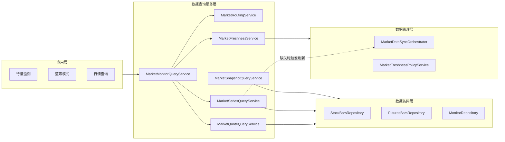
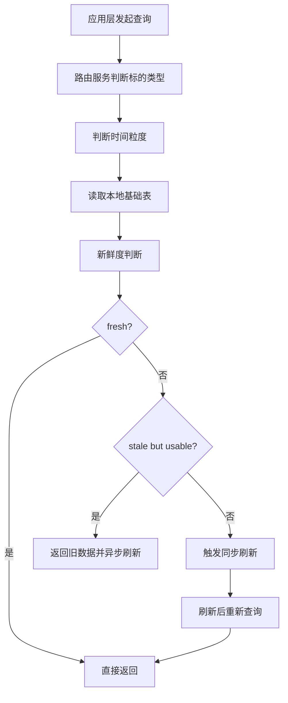
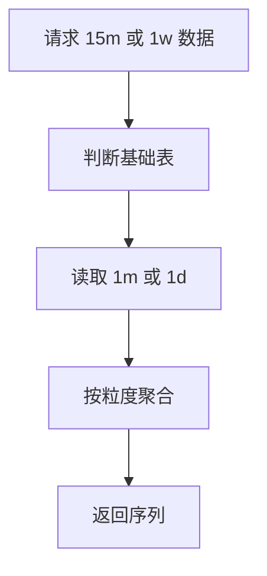

# 13 数据查询服务层设计

## 1. 层次定位

数据查询服务层负责：

**把本地行情数据以统一、可解释、可降级的方式提供给应用层。**

它是四层架构中的“统一查询和聚合层”。

## 2. 核心职责

数据查询服务层负责：

- 统一查询入口
- 股票/期货路由
- `intraday/eod` 路由
- 粒度聚合
- 新鲜度判断
- 来源说明输出
- warning / error 标准化
- 缺失时触发轻量刷新

数据查询服务层不负责：

- 定时同步
- 手动补数
- 数据质量巡检
- 页面布局和交互
- Repository 细节

## 3. 层内模块拆分

建议拆分为：

- `MarketQuoteQueryService`
- `MarketSeriesQueryService`
- `MarketSnapshotQueryService`
- `MarketMonitorQueryService`
- `MarketFreshnessService`
- `MarketRoutingService`

## 4. 层内架构图



## 5. 统一查询规则

### 5.1 标的路由

根据 `symbol_type` 路由：

- `stock` -> 股票链路
- `futures` -> 期货链路
- `index` -> 指数链路

### 5.2 粒度路由

- `1m/5m/15m/30m/60m` -> `*_intraday_bars`
- `1d/1w/1M/1Y` -> `*_eod_bars`

### 5.3 聚合规则

- `5m/15m/30m/60m` 从 `1m` 聚合
- `1w/1M/1Y` 从 `1d` 聚合

## 6. 查询模式

### 6.1 直接命中本地

当数据 `fresh` 时：

- 直接返回本地结果
- 不触发刷新

### 6.2 返回旧数据并异步刷新

当数据 `stale_but_usable` 时：

- 先返回旧数据
- 返回 warning
- 后台异步触发刷新

### 6.3 同步刷新后返回

当数据 `missing` 且本次查询不能容忍缺失时：

- 触发轻量抓取
- 回写本地
- 重新查询
- 返回新结果

## 7. 统一输出 DTO

建议所有应用层都消费统一结构：

```json
{
  "symbol": "600519",
  "symbolType": "stock",
  "displayName": "贵州茅台",
  "timeframe": "1m",
  "quote": {
    "last": 1688.0,
    "change": 12.3,
    "changePct": 0.73
  },
  "series": [],
  "quoteSource": "tencent.quote",
  "seriesSource": "stock_intraday_bars",
  "freshness": "fresh",
  "warning": null,
  "error": null,
  "fetchedAt": "2026-05-13T10:30:00+08:00"
}
```

## 8. 核心流程

### 8.1 统一查询流程



### 8.2 聚合查询流程



## 9. 应用层依赖方式

应用层不直接调用多个底层查询服务，而是优先通过聚合入口，例如：

- `MarketMonitorQueryService`
- `MarketSnapshotQueryService`

这样应用层只需要关心：

- 我想查什么
- 我想展示什么

而不需要关心：

- 查哪张表
- 是否需要聚合
- 是否触发刷新
- 是否该返回 warning

## 10. 与其它层的边界

### 对上

服务对象：

- 行情监测
- 蓝筹模式
- 行情查询
- 其它业务分析页面

### 对下

依赖：

- 数据访问层
- 数据管理层的新鲜度与刷新能力

### 不越界

- 不承担定时同步
- 不承担手动补数
- 不承担页面交互
- 不承担 SQL 细节

## 11. 层次结论

数据查询服务层文档只回答：

- 数据怎么统一查
- 怎么做股票/期货和粒度路由
- 怎么判断新鲜度
- 怎么做聚合和降级
- 怎么把结果稳定输出给应用层

它不再承担数据治理设计，也不承担具体页面功能设计。
